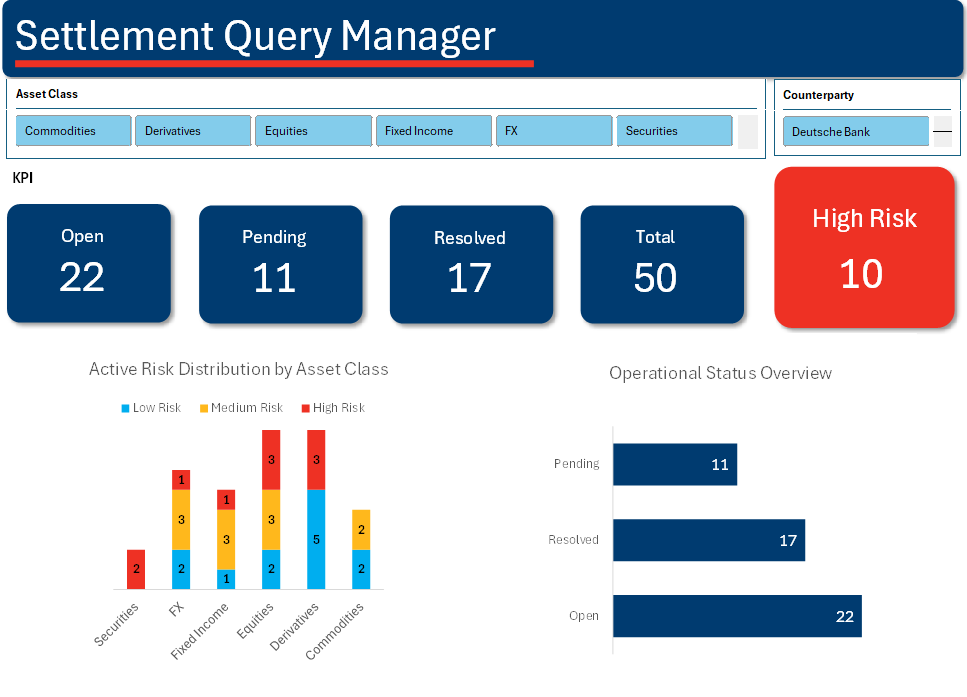

# Settlement_Query_Manager
A dynamic Excel-based risk management tool designed to centralise trade exceptions and prioritise Aged Risk across global markets. 

## Executive Summary
This project involves the creation of an interactive dashboard and Aged Risk Tracker for a Markets Operations environment. The tool is engineered to provide real-time visibility into trade settlement queries, prioritising "High Risk" to ensure regulatory compliance. By transitioning from static data lists to a dynamic, risk-first visualization, the dashboard reduces management blind spots and accelerates decision-making.

## Visual Preview


## Problem Statement
In high-volume financial operations, client queries can be spread across multiple desks. Manual tracking leads to "Aged Risks" - trades that remain unsettled past their value date, increasing financial exposure.

## Objectives
* **Centralisation** - Consolidate trade queries into a single resource.
* **Mitigate Risk** - Implement logic to categorise trades into Low, Medium and High Risk buckets and flag High Risk buckets.
* **Dynamic Interactivity** - Enable desk-specific drill downs using synchronised slicers.

## Technical Highlights

### Aging Logic (NETWORKDAYS)
Calculates trade latency based on business days rather than calander days. Through integrating a MAX(0,) wrapper, the logic eliminates negative aging values for trades settled on the same day and accurately reflects trade settlement cycles by excluding weekends and holidays.

```excel
=MAX(0,IF([@Status]="Resolved", IF(ISBLANK([@[Resolution Date]]), 0, NETWORKDAYS([@[Date Received]], [@[Resolution Date]]) - 1), NETWORKDAYS([@[Date Received]], DemoDate) - 1))
```
### Dynamic Tables
Utalises structured tables to make the dashboard scalable, This means formulas, Pivot Table ranges and conditional formatting automatically expand as new trade queries are added. Minimising manual maintenance and broken range references.

### Logic Bridge (GETPIVOTDATA) (IFERROR)
Contains a connection layer between the raw data and the UI. By using the GETPIVOTDATA and IFERROR functions, the dashboard maintains data integrity during zero volume.

```excel
=IFERROR(GETPIVOTDATA("Query ID",Calculation_Sheet!$B$4,"Status","Open"),0)
```

## Usage Instructions
This dashboard is designed for interactive exploration, follow these steps to perform a Risk Analysis:

1. Global Filtering
Use the slicer panel across the top of the dashboard to filter by Asset Class (Securities, FX). To multi select hold ctrl while clicking to view multiple categories simultaneously.

* ### 2. Identifying High Risk Exceptions
Observe the red KPI score card on the right hand side, this card is linked via the logic bridge to display the total count of queries aged 4 or more days old. Select the Counterparty slicer and scroll down to see a breakdown of which particular firms (Barclays PLC, BlackRock Global) are driving that exposure.

* ### 3. Resetting the view
Click the clear filter icon at the top right hand corner of any Slicer to return to the global, total exposure, view.

* ### 4. Data Maintenance
To update the dashboard with a new query, paste entries into the the Data Table and select Refresh All, the Pivot Tables and logic bridge will automatically recalculate the aged risk buckets.

## Technical Report
A technical report of the project, including a full analysis of the data, can be found here: **[Download the Technical Report](docs/Technical_Report.pdf)**

---

## Disclaimer
All data contained within this project is entirely synthetic. Names, ID's ad Counterparty details have been generated for demonstrative purposes only, to sensure compliance with data protection and privacy standards. This project does not include any proprietary information or real world client data. 
